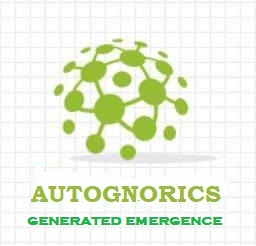

# AUTOGNORICS: 
## The Science of Engineered Life Forms

WELCOME TO THE WORLD OF ANEURAL INTUITIVE MACHINES.

Autognorics is the science of creating engineered life forms, machines, or systems that are alive, living, and with life. In short, it is the study of creating a living Intuitive Machine (IM) that can see, smell, taste, hear, speak, feel, think, breed, fly, swim, and die too. It was conceptualized by Engr Joey Lawsin in 1988 who wanted to reshape the framework of artificial intelligence and machine learning by introducing a novel cognitive concept known as The Brein Theory or A Brain without The Brain paradigm shift. In this new paragon, Inscription by Design and Generated Interim Emergence are the essential foundations in the creation of these synthetic life-forms called ELFS. These engineered-life-forms (elfs) are classified as gnorics, homognorics, biognorics, and zoikrons.

SELFS or the System of Engineered Life-forms, technically called Autognorization, is a hierarchical system, process, or approach where binary inherent network systems (BINS), intuitive aneural networks(IAN), intuitive machines(IM), embedded inscriptions(EI), intuitive object(IO)s, generated interim emergence (GENIE), Inscriptionism, Viegeneism, brein, gnomi, gnos, interims, and inscription by design(ID) are incorporated together in the creation of a living machine or system that embodies the seven signatures of life, namely: the mechanization of aliveness, the sensation of awareness, the codification of consciousness, the intuitiveness of logic, the inlearness of information, symbiosis of living, and the emergence of self.

According to Lawsin, Life evolves from being alive to being living to having life. Life is a package of individual evolutionary processes that is governed by seven stages. These life signatures or sequential orders of Life referred to as the Laws of Seven Inscription are as follows:

1. Aliveness = is the ability to consume energy without the need for neural reasoning.
2. Awareness = is the ability to send and receive signals using intuitive sensors without the need for neural reasoning.
3. Consciousness = is the ability to match things with things without the need for neural reasoning.
4. Intutiveness = is the ability to choose this or that without the need for neural reasoning.
5. Inlearness = is the ability to acquire and use information.
6. Livingness = is the ability to experience to live.
7. Selfness = is the ability to recognize oneself.

In the succeeding articles, the following new concepts in the creation of a Living Machine are examined:
1. [The Sensoric Awareness of a Machine](https://autognorics.github.io/Sensoric_Awareness/)
2. [The Associative Consciousness of a Machine](https://autognorics.github.io/Aneural_Consciousness/)
3. [The Algorithmic Intuitiveness of a Machine](https://autognorics.github.io/Algorithmic_Intuitiveness/)
4. [The Aneural Intelligence of a Machine](https://autognorics.github.io/Neural-Selfness/) 
5. [Intuitive Objects and Embedded Inscriptions](https://autognorics.github.io/Intuitive_Objects/)
6. [A Brain without the Brain Paradigm](https://autognorics.github.io/Aneural-Intuitive-Systems/)
7. [The Making of a Living Conscious Machine](https://autognorics.github.io/Engineered_Life_Forms/)
8. [Autognorics:The Science of Engineered Life Forms](https://autognorics.github.io/Autognorics/)

The new concept Autognorics was uncovered from the study on Orignemology.

Originemology is the science behind the beginning of everything, the "study of the origin of origins". It is a pioneering discipline that examines generally the roots or origins of everything and everyone based on the natural emergence of instructions comprehensively known as Creation by Law. It deals with the etymology, originator, history, semantics, onomatology, eponym, and origin of a thing, a word, a label, tag, or idea.

This new school of thought was conceptualized mainly to determine the Genesis of Information - the origin, creation, and evolution of early primordial, ancient, and modern information based on the following basic scientific questions:

1. How did information emerge into the early minds of the very first humans?
2. Who supplied our primitive ancestors with information?
3. Where did it originate? Where did it come from?
4. Was the source of information a who or a what? Was it god, space aliens, or something else?
5. What is creation by laws?

Its integral component is twofold: first, it examines the origins of ideas, labels, or concepts made-up by man like languages, numbers, behaviors, emotions, gods, tools; and second, it investigates the origins of objects created by nature like the universe, elements, plants and animals.

In a broader sense, Originemology is a cross-interdisciplinary body of thoughts based on prevailing comparative researches found in many subfields of study such areas as anthropology, archaeology, geography, history, chronology, etymology, ideology, onomatology, ontology, and epistemology. The main goal of the collaboration is to systematically trace backward the primal source or origin of information or idea - either abstract or physical, from being a single elemental entity to an emerging complex structure - with evidence-based findings and guided by these 5 primary questions:

1. How did the original idea emerge?
2. Who provided the original idea?
3. Where was the idea first conceptualized
4. When was the idea first conceptualized?
5. Why was the idea conceptualized in the first place?

The five cardinal collaborating principles that lay the foundations of Originemology constitute the following signature theories:
1. The Caveman in the Box Trilogy,
2. Information Codexation,
3. Structural Embedded Inscriptions
4. Inscription by Design
5. Generated Interim Emergence

The new study is also instrumental in shedding new insights into the five major ancient questions:
1. Who or what created the universe?
2. How all creation is created?
3. Where did we come from?
4. Why are we here?

On this article, fragments of text were extracted from the book Originemology. Some ideas that even emerged in the early version of the manuscript on Creation by Laws are also presented here. Even, the general views discussed in this hub were covered from the various exploratory experiments conducted in the Biotronics Project (Lawsin,1988). While AI can have consciousness, intelligence, and possesing life, AI can never become a human being due to the fact of [Lawsin's AI Paradox](https://github.com/Autognorics/AI-Paradox).

### Keywords:
-    eaftos = self
-    gnosei = knowledge
-    aftognosia = self-knowledge
-    zois = life-forms
-    Gnorics = self-knowledge life-forms
-    Autognorics = the science of creating living intuitve machines
-    Abioforms = entities that are alive and living but without life
-    Bioforms = entities that are alive, living, and with life.
-    Homognorics = living machines in human forms
-    Biognorics = living machines that look like animals, plants, insects, microbes, fungus, and cells.
-    AI Paradox = a conscious AI can never become a human being due to by chance
-    Viegeneism = philosophy about existence, non-existence, and latent existence.
-    Inscriptionism = a philosophy of creation through intuitive materials and embedded instructions
-    SELFS = Systems of Engineered Life-Forms
-    ELFS = engineered life-forms
-    BINS = binary intuitive network storage systems
-    BREIN = A Brain without The Brain Paradigm

> "Existence is engineered, not random." ~ Joey Lawsin

